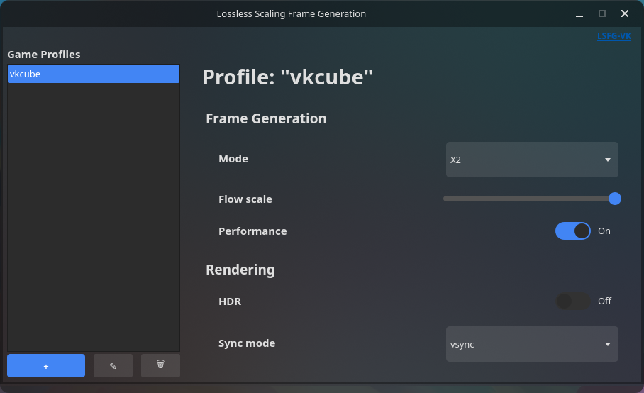

# lsfg-vk-qt-ui
qt user interface for [lsfg-vk](https://github.com/PancakeTAS/lsfg-vk/)

not officially endorsed by them, nor should it be

## dependencies
- [lsfg-vk](https://github.com/PancakeTAS/lsfg-vk/)
- Python 3.7+
- [PySide6](https://pypi.org/project/PySide6/)
- [toml](https://pypi.org/project/toml/)

install dependencies (besides lsfg-vk) with:

```bash
pip install PySide6 toml
```

## installing
download and run with
```bash
git clone https://github.com/caliswagilistic/lsfg-vk-qt-ui.git
cd lsfg-vk-qt-ui
python lsfg-vk-qt-ui.py
```
would recommended creating a .desktop file that with an exec of Exec=python /path/to/lsfg-vk-ui.py

example:
```bash
[Desktop Entry]
Name=Lossless Scaling Frame Generation
Comment=Lossless Scaling Frame Generation UI
Exec=python /path/to/lsfg-vk-ui.py
Icon=/icon/if/you/want.png

```

## etc, etc
heres a screenshot of the app:



## disclaimer
this application is held together by numerous paperclips and rubber bands

i would add an appimage but it made the app look significantly worse for me and im too lazy to figure it out right now (probably just dumb)

updates are not guaranteed, things will likely break if they dont already

