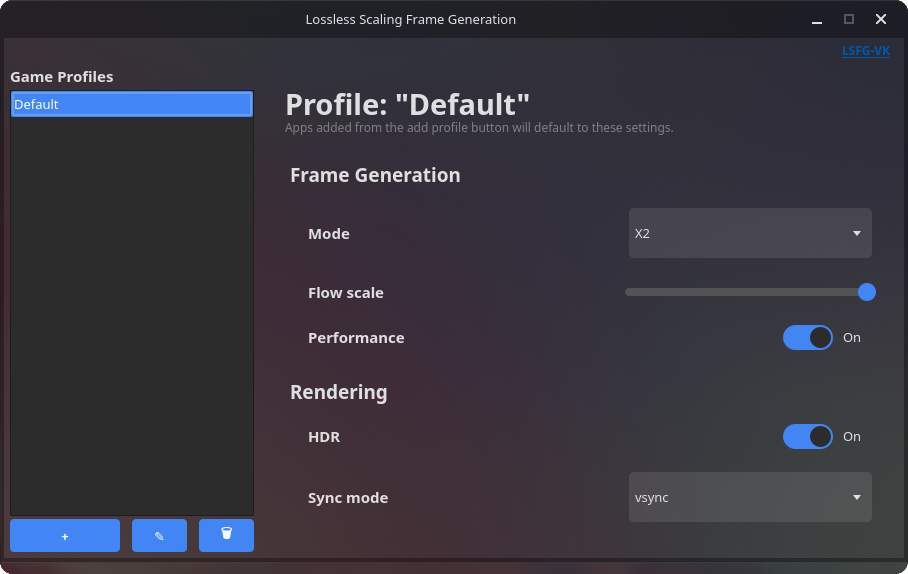

# lsfg-vk-qt-ui
qt user interface for lsfg-vk
## dependencies
- [lsfg-vk](https://github.com/PancakeTAS/lsfg-vk/)
- Python 3.7+
- [PySide6](https://pypi.org/project/PySide6/)
- [toml](https://pypi.org/project/toml/)

install dependencies (besides lsfg-vk) with:

```bash
pip install PySide6 toml
```

## installing
download and run with
```bash
git clone https://github.com/caliswagilistic/lsfg-vk-qt-ui.git
cd lsfg-vk-qt-ui
python lsfg-vk-qt-ui.py
```
would recommended creating a .desktop file that with an exec of Exec=python /path/to/lsfg-vk-ui.py

example:
```bash
[Desktop Entry]
Name=Lossless Scaling Frame Generation
Comment=Lossless Scaling Frame Generation UI
Exec=python /path/to/lsfg-vk-ui.py
Icon=/icon/if/you/want.png

```

for the "Game Profiles" just put the name of the executable you want it on.

## troubleshoot
if you're having trouble finding the correct app name for your game, run this in a bash script and it should list it for you
```bash
for pid in /proc/[0-9]*; do
    owner=$(stat -c %U "$pid" 2>/dev/null)
    if [[ "$owner" == "$USER" ]]; then
        if grep -qi 'vulkan' "$pid/maps" 2>/dev/null; then
            procname=$(cat "$pid/comm" 2>/dev/null)
            if [[ -n "$procname" ]]; then
                printf "PID %s: %s\n" "$(basename "$pid")" "$procname"
            fi
        fi
    fi
done
```

## etc, etc
heres a screenshot of the app:



dont expect much in terms of updates, i have no idea what im doing
